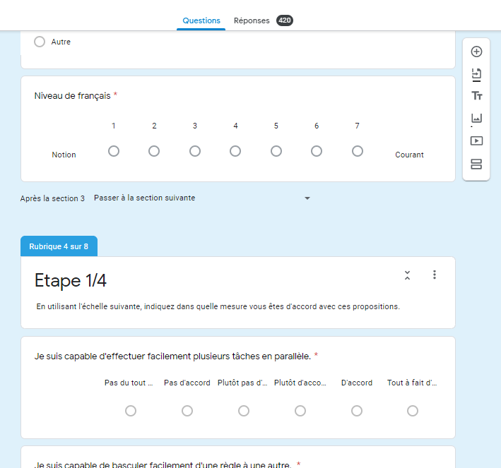

```{r setup, include=FALSE, warning = FALSE, message = FALSE}
knitr::opts_chunk$set(warning = FALSE, message = FALSE)
library(flexdashboard)
library(tidyverse)
library(reshape2)
library(kableExtra)
library(ggraph)
options(knitr.kable.NA = '')

data <- params$data
data_cleaned_scale = params$data_scale
data_cleaned_wcst = params$data_wcst
data_pretest = params$data_pretest
# This script check what item got more than 20% of response in the extreme values. It then create a new dataframe containing only the items non extreme. 

## Create dataframe with upper item and lower item frequencies of response
frequencies  = data.frame(item = character(10), upper = numeric(10), lower = numeric(10))
for(i in 1:10){
  upper = length(which(nflex_inv[i]==6))/nrow(nflex_inv)
  lower = length(which(nflex_inv[i]==1))/nrow(nflex_inv)
  frequencies$item[i] = paste0("nflex_", as.character(i))
  frequencies$upper[i] = upper
  frequencies$lower[i] = lower
}
rm(upper, lower, i)

## Create a list used to delete item that have more than 20% of extreme values.
list = c()
for(i in 1:10){
  if(frequencies[i,2]>.20 | frequencies[i,3]>.20 ){
    list = c(list, i)
    }
}
# Create a dataframe with the remaining items of the General Cognitive Flexibility (GCF)
nflex_inv_reduct = nflex_inv[,-list]
rm(list,i)
# Compute new dataset of nflex without item 8 and 9
nflex_inv_reduct_msa = nflex_inv_reduct[,-c(5,6)]

# Compute polychoric correlation with all item (minus extrem values items)
poly_nflex_inv_reduct = polychoric(nflex_inv_reduct)
poly_nflex_inv_reduct = poly_nflex_inv_reduct$rho
poly_nflex_inv_reduct = cor.smooth(poly_nflex_inv_reduct, eig.tol=10^-12)

#Compute polychoric correlation with the item 8 and 9 removed
poly_nflex_inv_reduct_msa = polychoric(nflex_inv_reduct_msa)
poly_nflex_inv_reduct_msa = poly_nflex_inv_reduct_msa$rho
poly_nflex_inv_reduct_msa = cor.smooth(poly_nflex_inv_reduct_msa, eig.tol=10^-12)
```


Home {data-icon="fa-home"}
===================================== 
Row
-------------------------------------
### Items

```{r}
valueBox(4, icon = "fa-question-circle")
```

### Factors

```{r}
valueBox(1, icon = "fa-sitemap", color=ifelse(1>1, "warning","primary"))
```

### Subjects

```{r}
valueBox(350, icon = "fa-border", color="success")
```

Row
-------------------------------------
### **Presentation**

Welcome to the data analysis of the **General Cognitive Flexibility** Scale (GCF or `nflex`). Here, you'll find everything that was done to assess if the scale is suitable for futur use. 
Using [R Markdown](http://rmarkdown.rstudio.com) and the [flexdashboard package](https://rmarkdown.rstudio.com/flexdashboard/index.html), we provide all the graphs, table and analysis that was executed, along with a dataset of simulated data to reproduce the same analysis. 
\
All participant gave their agreement for us to use those data, as long as they couldn't be identified by any means.\

The dataset contained in this folder is setup as follow : \
- A row = an observation\
- A column = a variable\


Row
--------------------------------------------
### *What's inside ?*
**There is multiple variables :**\
1.  `Age`,\
2.  `Sexe`,\
3.  Professionnal `situation`,\
4.  Response to the *Autism spectrum quotien scale's subset* named attention switching also named `att_switching_X` in the dataframe (Baron-Cohen et al., 2011)\
5.  Response to the *cognitive flexibility scale* named `cfs_X` in the dataframe (Martin & Rubbin, 1995)\
6.  Response to the *Resistance to Change Scale*'s Subset named Cognitive Rigidity also named `cognitive_rigidity_X` in the dataset (Oreg, 2003)\
7.  Response to the *General Cognitive Flexibility Scale* also named `nflex_X` in the dataframe (work-in-progress ; Weiss & Chene, 2020)\


Row
------------------------------------
### *Références:*

1.  Martin, M. M., & Rubin, R. B. (1995). A New Measure of Cognitive Flexibility. 
    *Psychological Reports, 76(2)*, 623‑626. https://doi.org/10.2466/pr0.1995.76.2.623

2.  Baron-Cohen, S., Wheelwright, S., Skinner, R., Martin, J., & Clubley, E. (2001). The Autism-Spectrum Quotient (AQ) : 
    Evidence from Asperger Syndrome/High-Functioning Autism, Malesand Females, Scientists and Mathematicians. 
    *Journal of Autism and Developmental Disorders, 31(1)*, 5‑17.

3.  Oreg, S. (2003). Resistance to change : Developing an individual differences measure. 
    *Journal of Applied Psychology, 88(4)*, 680‑693. https://doi.org/10.1037/0021-9010.88.4.680

4.  R Core Team (2020). R: A language and environment for statistical computing. *R Foundation for Statistical Computing*,
     Vienna, Austria. URL https://www.R-project.org/.

Steps {.storyboard}
=================================

### Step 1 : Build your items {data-commentary-width=700}

```{r}
print("Building items require to read a lot of other scales (rigidity scales, other flexibility scales) but check cognitive tasks as well")
```


***


### Step 2 : Evaluated the item with a pre-test (N = 80) {data-commentary-width=700}

```{r  out.width = "70%"}
ggplot_data_pt = data_pretest[,-c(1)]
ggplot_data_pt = ggplot_data_pt %>% 
  rename(Q1 = Item.1,Q2 = Item.2,Q3 = Item.3,Q4 = Item.4,Q5 = Item.5,Q6 = Item.6,Q7 = Item.7,Q8 = Item.8,Q9 = Item.9,Q10 = Item.10, Q11 = Item.11)

w = ggplot(gather(ggplot_data_pt), aes(x=value)) + 
  geom_histogram(stat = "count") + facet_wrap(~key, scales = 'free_x') +
  scale_color_grey() +
  theme_apa() +
  theme(legend.position = "bottom") +
  xlab("General FLexibility Scale PreTest") + ylab("N") + geom_vline(xintercept = 4, color="#44a3e3")
ggplotly(w)
```

***
The goal here was to check if the use of a *7 Likert item scale* was good for our items. We also checked if some item were really bad. During this pre-test, subjects told us that `Q5` was really to hard to understand. We therefore removed it for futur analysis. We can also see that a *7 Likert item Scale* isn't suitable. There isn't a lot of response for the middle choice (as we can see on thos histograms with the blue line).
We couldnt delete other items by looking at the distribution, because the Likert Scale Wasn't good enough. We choose to dial back and take a *6-point Likert Scale*, to force a polarity answer and avoid the middle choice pit problem.
<br><br><br><br><br><br><br><br><br><br><br><br><br><br><br><br><br><br><br><br><br>

### Step 3 : Build a new questionnaire (N = 350) and stating hypothesis {data-commentary-width=700}

```{r echo=FALSE}

``` 

***
During this step, we changed the *7-point Likert Scale* to a *6-point Likert scale*. We also **removed the `Q5`** item of the pretest, as it was labelled as "not understandable". Therefore, the `Q5` item in the new questionnaire doesn't refer to the same sentence. We also put 3 other scales (resistance to change subscale, autisme quotient subscale, cognitive flexibility scale), and added at the end an url to a numerised WCST task.\

**Hypothesis :**\
Our `nflex` (alias GCF) scale should be **highly correlated** with the *WCST*. *Resistance to change* scale should be **negatively correlated**, *autism quotient* subscale should be **positively correlated** and *cognitive flexibility scale* shoudl **not be correlated**. We made thos assumptions based on scientific litterature (neuropsychological report, social psychologic reports, cognitive psychologic report) using pubMed and PsychInfo database. We also expect to have a **1-factor** structur but need to use EFA instead of CFA, as nobody validated the `nflex` scale before. 
<br><br><br><br><br><br><br><br><br><br><br><br><br><br><br><br><br><br><br><br><br><br><br>

### Step 4 : Assess Items distribution and discrimination {data-commentary-width=700}

```{r}
ggplot_data = nflex_inv
ggplot_data = ggplot_data %>% 
  rename(Q1 = nflex_1,
         Q2 = nflex_2,
         Q3 = nflex_3,
         Q4 = nflex_4,
         Q5 = nflex_5,
         Q6 = nflex_6,
         Q7 = nflex_7,
         Q8 = nflex_8,
         Q9 = nflex_9,
         Q10 = nflex_10)

w = ggplot(gather(ggplot_data), aes(x=value)) + 
  geom_histogram(stat = "count") + facet_wrap(~key, scales = 'free_x') +
  scale_color_grey() +
  theme_apa() +
  theme(legend.position = "bottom") +
  xlab("General FLexibility Scale") + ylab("N")
ggplotly(w)
```

***
This step is used to **assess the distribution of each item**. We added a *skewness* and *kurtosis* analysis to check if those distribution had a "normal-like" format. Each item with more than 20% of extreme values answers must be deleted. It translates to a bad item with **ceiling effect** or **bad discrimination power**. 
<br><br><br><br><br><br><br><br><br><br><br><br><br><br><br><br><br><br><br><br><br><br><br><br><br><br><br><br>

### Step 5 : Assess Items construct using an EFA

### Step 6 : Check for other scales validated construct using CFA

### Step 7 : Assess the validity of the GCF scale by checking correlations with other measures

Raw Data {data-icon="fa-table"}
=================================
Row
--------------------------------------------
### Comment
This page shows the raw datatable named `data` that contains the data used for the analysis, the descriptive statistics of this table, and some graphics that would help for a more indepth comprehension of the sample and its specificity.\

Row {data-width=400}
-------------------------------------
### Descriptive statistics
```{r}
DT::datatable(as.data.frame(psych::describe(data, omit = T,check = T))[,-c(1,2,6,7,10,13)],
              extensions = c('Buttons','ColReorder','Scroller'),
              options = list(
                buttons = c('excel','csv','pdf'),
                colReorder=T,
                scroller = T,
                scrollY="200px", 
                scrollX="100%",
                pageLength = 500,
                dom = 'Bfrti'
                )) %>% 
  formatRound(c(1:ncol(as.data.frame(psych::describe(data, omit = T,check = T)))),digits=2)
```


### Raw data table 
```{r}
DT::datatable(data[,-c(1)], 
              extensions = c('Buttons','ColReorder','Responsive','Scroller'),
              options = list(
                buttons = c('excel','csv'),
                colReorder=T,
                scroller = TRUE,
                scrollY="200px", 
                scrollX="100px",
                pageLength = 500,
                dom = 'Bfrti'),
              style="bootstrap4")
```


Row {data-height=400}
-------------------------------------
### Sexe Histogram
```{r}
data_ggplot = data
data_ggplot$situation = factor(data_ggplot$situation, levels=c("Etudiant", "Travailleur", "Sans emploi"))
data_ggplot$sexe = factor(data_ggplot$sexe, levels=c("Femme", "Homme", "Autre"))

## For sexe/age
p = ggplot(data=data_ggplot, aes(x=age, fill=sexe)) + 
  geom_histogram(color="#e9ecef", alpha=.9, position ="identity",binwidth = 2) + 
  scale_fill_manual(values=c("#404080", "#b8c2cc", "#69b3a2")) +
  theme_apa() +
  theme(legend.position = "right") +
  labs(fill="Sexe") +
  scale_x_continuous(name="Age", breaks = seq(0, 85, 10)) +
  ylab("N")
ggplotly(p)
```

### Situation Histogram
```{r}
data_ggplot = data
data_ggplot$situation = factor(data_ggplot$situation, levels=c("Etudiant", "Travailleur", "Sans emploi"))
data_ggplot$sexe = factor(data_ggplot$sexe, levels=c("Femme", "Homme", "Autre"))

## For sexe/age
q = ggplot(data=data_ggplot, aes(x=age, fill=situation))+
  geom_histogram(color="#e9ecef", alpha=.9, position ="identity",binwidth = 2) + 
  scale_fill_manual(values=c("#404080", "#b8c2cc", "#69b3a2")) +
  theme_apa() +
  theme(legend.position = "right") +
  ylab("N") +
  labs(fill="Situation") +
  scale_x_continuous(name="Age", breaks = seq(0, 85, 10))
ggplotly(q)
```

Row
-------------------------------------
### Sexe Counting {data-width=200}
```{r}
knitr::kable(as.data.frame(describe(data$sexe)$values), options = list(
  bPaginate = F))%>% kable_styling("striped", full_width = F, position="left")
```

### Situation Counting {data-width=200}
```{r}
knitr::kable(as.data.frame(describe(data$situation)$values), options = list(
  bPaginate = F))%>% kable_styling("striped", full_width = F, position="left")
```

Scale Data {data-icon="fa-table"}
=================================
Row
--------------------------------------------
### Comment
This page shows the dataset named `data_cleaned_scale` used for scale validation and GCF analysis. You'll find the descriptive statistics of this table, and some graphics that would help for a more indepth comprehension of the sample and its specificity.\


Row {data-width=400}
-------------------------------------
### Descriptive statistics
```{r}
DT::datatable(as.data.frame(psych::describe(data_cleaned_scale, omit = T,check = T))[,-c(1,2,6,7,10)],
              extensions = c('Buttons','ColReorder','Scroller'),
              options = list(
                buttons = c('excel','csv','pdf'),
                colReorder=T,
                scroller = T,
                scrollY="200px", 
                scrollX="100%",
                pageLength = 500,
                dom = 'Bfrti'
                )) %>% 
  formatRound(c(1:ncol(as.data.frame(psych::describe(data_cleaned_scale, omit = T,check = T)))),digits=2)
```

### Scale data table
```{r}
DT::datatable(data_cleaned_scale[,-c(1)], 
              extensions = c('Buttons','ColReorder','Responsive','Scroller'),
              options = list(
                buttons = c('excel','csv'),
                colReorder=T,
                scroller = TRUE,
                scrollY="200px", 
                scrollX="100px",
                pageLength = 500,
                dom = 'Bfrti'),
              style="bootstrap4")
```

Row {data-height=400}
-------------------------------------
### Sexe Histogram
```{r}
data_ggplot_scale = data_cleaned_scale
data_ggplot_scale$situation = factor(data_ggplot_scale$situation, levels=c("Etudiant", "Travailleur", "Sans emploi"))
data_ggplot_scale$sexe = factor(data_ggplot_scale$sexe, levels=c("Femme", "Homme", "Autre"))

## For sexe/age
m = ggplot(data_ggplot_scale, aes(x=age, fill=sexe)) + 
  geom_histogram(color="#e9ecef", alpha=.9, position ="identity",binwidth = 2) + 
  scale_fill_manual(values=c("#404080", "#b8c2cc", "#69b3a2")) +
  theme_apa() +
  theme(legend.position = "right") +
  labs(fill="Sexe") +
  scale_x_continuous(name="Age", breaks = seq(0, 85, 10)) +
  ylab("N")
ggplotly(m)
```

### Situation Histogram
```{r}
data_ggplot_scale = data_cleaned_scale
data_ggplot_scale$situation = factor(data_ggplot_scale$situation, levels=c("Etudiant", "Travailleur", "Sans emploi"))
data_ggplot_scale$sexe = factor(data_ggplot_scale$sexe, levels=c("Femme", "Homme", "Autre"))

## For sexe/age
l = ggplot(data_ggplot_scale, aes(x=age, fill=situation))+
  geom_histogram(color="#e9ecef", alpha=.9, position ="identity",binwidth = 2) + 
  scale_fill_manual(values=c("#404080", "#b8c2cc", "#69b3a2")) +
  theme_apa() +
  theme(legend.position = "right") +
  ylab("N") +
  labs(fill="Situation") +
  scale_x_continuous(name="Age", breaks = seq(0, 85, 10))
ggplotly(l)
```

Row
-------------------------------------
### Sexe Counting {data-width=200}
```{r}
knitr::kable(as.data.frame(describe(data_cleaned_scale$sexe)$values), options = list(
  bPaginate = F))%>% kable_styling("striped", full_width = F, position="left")
```

### Situation Counting {data-width=200}
```{r}
knitr::kable(as.data.frame(describe(data_cleaned_scale$situation)$values), options = list(
  bPaginate = F))%>% kable_styling("striped", full_width = F, position="left")
```


WCST Data {data-icon="fa-table"}
=================================

Row
--------------------------------------------
### Comment
This page shows the dataset names `data_cleaned_wcst` used for WCST validation with GCF construct. You'll find the descriptive statistics of this table, and some graphics that would help for a more indepth comprehension of the sample and its specificity.\

Row  {data-width=400}
-------------------------------------
### Descriptive statistics
```{r}
DT::datatable(as.data.frame(psych::describe(data_cleaned_wcst, omit = T,check = T))[,-c(1,2,6,7,10)],
              extensions = c('Buttons','ColReorder','Scroller'),
              options = list(
                buttons = c('excel','csv','pdf'),
                colReorder=T,
                scroller = T,
                scrollY="200px", 
                scrollX="100%",
                pageLength = 500,
                dom = 'Bfrti'
                )) %>% 
  formatRound(c(1:ncol(as.data.frame(psych::describe(data_cleaned_wcst, omit = T,check = T)))),digits=2)
```

### WCST data table
```{r}
DT::datatable(data_cleaned_wcst[,-c(1)], 
              extensions = c('Buttons','ColReorder','Responsive','Scroller'),
              options = list(
                buttons = c('excel','csv'),
                colReorder=T,
                scroller = TRUE,
                scrollY="200px", 
                scrollX="100px",
                pageLength = 500,
                dom = 'Bfrti'),
              style="bootstrap4")
```


Row {data-width=400}
-------------------------------------
### Sexe Histogram
```{r}
data_ggplot = data_cleaned_wcst
data_ggplot$situation = factor(data_ggplot$situation, levels=c("Etudiant", "Travailleur", "Sans emploi"))
data_ggplot$sexe = factor(data_ggplot$sexe, levels=c("Femme", "Homme", "Autre"))

## For sexe/age
j = ggplot(data=data_ggplot, aes(x=age, fill=sexe)) + 
  geom_histogram(color="#e9ecef", alpha=.9, position ="identity",binwidth = 2) + 
  scale_fill_manual(values=c("#404080", "#b8c2cc", "#69b3a2")) +
  theme_apa() +
  theme(legend.position = "right") +
  labs(fill="Sexe") +
  scale_x_continuous(name="Age", breaks = seq(0, 85, 10)) +
  ylab("N")
ggplotly(j)
```

### Situation Histogram
```{r}
data_ggplot_wcst = data_cleaned_wcst
data_ggplot_wcst$situation = factor(data_ggplot_wcst$situation, levels=c("Etudiant", "Travailleur", "Sans emploi"))
data_ggplot_wcst$sexe = factor(data_ggplot_wcst$sexe, levels=c("Femme", "Homme", "Autre"))

## For sexe/age
h = ggplot(data_ggplot_wcst, aes(x=age, fill=situation))+
  geom_histogram(color="#e9ecef", alpha=.9, position ="identity",binwidth = 2) + 
  scale_fill_manual(values=c("#404080", "#b8c2cc", "#69b3a2")) +
  theme_apa() +
  theme(legend.position = "right") +
  ylab("N") +
  labs(fill="Situation") +
  scale_x_continuous(name="Age", breaks = seq(0, 85, 10))
ggplotly(h)
```

Row
-------------------------------------
### Sexe Counting {data-width=200}
```{r}
knitr::kable(as.data.frame(describe(data_cleaned_wcst$sexe)$values), options = list(
  bPaginate = F)) %>% kable_styling("striped", full_width = F, position="left")
```

### Situation Counting {data-width=200}
```{r}
knitr::kable(as.data.frame(describe(data_cleaned_wcst$situation)$values), options = list(
  bPaginate = F))%>% kable_styling("striped", full_width = F, position="left")
```


Item description {data-icon="fa-satellite"}
=================================
Row
---------------------------------
### 
<br><br><br><br><br><br><br><br><br><br><br>
<center> **ITEM DESCRIPTIVE ANALYSIS** </center>

### Description {data-width=700 data-height=400}
This page shows histograms of the 4 scales we used in our research. We analysed the General Cognitive Flexibility Scale to check if any items needed to be removed. Conclusion of this analysis is stated below :\

The **Table 1** shows items with more than 20% of extreme values. **Items 1, 4, 6, 10** seems to have *ceiling* or *skewed* distribution. It is then recommended to check if **extreme values** of each item (values 1 and 6) have more than 20% of the responses. We therefore check for *skewness* and *kurtosis*. (Garin, 2014 ; Benzina, 2019)\
\
**Reminder **:\
The skewness coefficient is a third-order measure of the central tendency of the sample. A negative coefficient translate to a biased distribution toward the right. A positive coefficient translate to a biased distribution toward the left. $$Skewness \space equation : \gamma_{X} = E\left[\left(\frac{X - \mu}{\sigma}\right)^3\right]$$ \
The kurtosis coefficient is a 4th order measure of the central tendency of the sample. It translate to how fast the distribution goes back to 0 (if it does). Therefore, it shows if there is more extreme values than it should. A high kurtosis translate to a higher number of extreme values. $$Kurtosis \space equation : K[X] = E\left[\left(\frac{X - \mu}{\sigma}\right)^4\right]$$

<br><br>

Row {data-height=500}
-------------------------------------
### General Cognitive Flexibility Histogram {data-width=300}
```{r}
ggplot_data = nflex_inv
ggplot_data = ggplot_data %>% 
  rename(Q1 = nflex_1,
         Q2 = nflex_2,
         Q3 = nflex_3,
         Q4 = nflex_4,
         Q5 = nflex_5,
         Q6 = nflex_6,
         Q7 = nflex_7,
         Q8 = nflex_8,
         Q9 = nflex_9,
         Q10 = nflex_10)

w = ggplot(gather(ggplot_data), aes(x=value)) + 
  geom_histogram(stat = "count") + facet_wrap(~key, scales = 'free_x') +
  scale_color_grey() +
  theme_apa() +
  theme(legend.position = "bottom") +
  xlab("General FLexibility Scale") + ylab("N")
ggplotly(w, width = 500, height= 400)
```

### Table 1 {data-width=100}
```{r}
item = colnames(nflex_inv)
kurt_skew = as.tibble(round(skewness(nflex_inv), 2)) %>% 
  mutate(kurtosis = round(kurtosis(nflex_inv), 2)) %>% 
  cbind(item) %>% 
  rename(skewness = value) %>% 
  mutate(skewness, color= ifelse(abs(skewness) > .22, "red","black"))
knitr::kable(kurt_skew[, c(3,1,2)]) %>% kable_styling()
```

### *References* {data-width=100}
Benzina, N (2019). Évaluation de la flexibilité cognitive dans le trouble obsessionnel compulsif : étude de la validité de deux auto-questionnaires comparés à une tâche expérimentale. *Médecine humaine et pathologie*.

Row {data-height=500}
-------------------------------------
### Attention Switching subscale {data-width=300}
```{r}
x = ggplot(gather(data_cleaned_scale[,11:20]), aes(x=value)) + 
  geom_histogram(stat = "count") + facet_wrap(~key, scales = 'free_x') +
  scale_color_grey() +
  theme_apa() +
  theme(legend.position = "bottom") +
  xlab("Attention Switching") + ylab("N")
ggplotly(x, width = 600, height= 400)
```

### Table 2 {data-width=100}
```{r}
item = colnames(data_cleaned_scale[,11:20])
kurt_skew = as.tibble(round(skewness(data_cleaned_scale[,11:20]), 2)) %>% 
  mutate(kurtosis = round(kurtosis(data_cleaned_scale[,11:20]), 2)) %>% 
  cbind(item) %>% 
  rename(skewness = value)
knitr::kable(kurt_skew[, c(3,1,2)])%>% kable_styling()
```

### *Reference* {data-width=100}
Sonié, S., Kassai, B., Pirat, E., Bain, P., Robinson, J., Gomot, M., Barthélémy, C., Charvet, D., Rochet, T., Tatou, M., Assouline, B., Cabrol, S., Chabane, N., Arnaud, V., Faure, P., & Manificat, S. (2013). The French Version of the Autism-Spectrum Quotient in Adolescents : A Cross-Cultural Validation Study. *Journal of Autism and Developmental Disorders*, *43(5)*, 1178‑1183. 

Row {data-height=500}
-------------------------------------
### Cognitive Rigidity Subscale {data-width=300}
```{r}
s = ggplot(gather(data_cleaned_scale[,7:10]), aes(x=value)) + 
  geom_histogram(stat = "count") + facet_wrap(~key, scales = 'free_x') +
  scale_color_grey() +
  theme_apa() +
  theme(legend.position = "bottom") +
  xlab("Cognitive Rigidity") + ylab("N")
ggplotly(s, width =600, height= 400)
```

### Table 3 {data-width=100}
```{r}
item = colnames(data_cleaned_scale[,7:10])
kurt_skew = as.tibble(round(skewness(data_cleaned_scale[,7:10]), 2)) %>% 
  mutate(kurtosis = round(kurtosis(data_cleaned_scale[,7:10]), 2)) %>% 
  cbind(item) %>% 
  rename(skewness = value)
knitr::kable(kurt_skew[, c(3,1,2)])%>% kable_styling()
```

### *Reference* {data-width=100}
Oreg, S. (2003). Resistance to change : Developing an individual differences measure. *Journal of Applied Psychology*, *88(4)*, 680‑693. https://doi.org/10.1037/0021-9010.88.4.680

Row {data-height=500}
-------------------------------------
### Cognitive Flexibility Scale {data-width=300}
```{r}
f = ggplot(gather(data_cleaned_scale[,31:42]), aes(x=value)) + 
  geom_histogram(stat = "count") + facet_wrap(~key, scales = 'free_x') +
  scale_color_grey() +
  theme_apa() +
  theme(legend.position = "bottom") +
  xlab("Cognitive Flexibility Scale") + ylab("N")
ggplotly(f, width = 600, height= 400)
```

### Table 4 {data-width=100}
```{r}
item = colnames(data_cleaned_scale[,31:42])
kurt_skew = as.tibble(round(skewness(data_cleaned_scale[,31:42]), 2)) %>% 
  mutate(kurtosis = round(kurtosis(data_cleaned_scale[,31:42]), 2)) %>% 
  cbind(item) %>% 
  rename(skewness = value)
knitr::kable(kurt_skew[, c(3,1,2)])%>% kable_styling()
```

### *Reference* {data-width=100}
Martin, M. M., & Rubin, R. B. (1995). A New Measure of Cognitive Flexibility. *Psychological Reports*, *76(2)*, 623‑626. https://doi.org/10.2466/pr0.1995.76.2.623

EFA {data-icon="fa-chart-line"}
=================================
Row {data-height=400}
----------------------------
```{r message=FALSE, warning=FALSE, paged.print=FALSE, include=FALSE}
#Create models for parallel analysis and EFA :
pa_nflex = fa.parallel(poly_nflex_inv_reduct_msa, fm="pa", fa="fa", main = "Scree Plot", se.bars = T, n.obs = nrow(nflex_inv_reduct_msa), plot = F)
fit_nflex = fa(nflex_inv_reduct_msa, cor="poly", nfactors = pa_nflex$nfact, fm="pa", rotate="none", residuals = T, correct=F, SMC=c(.09796, .1277,.1005,.1609))
fit_omega_nflex = omega(m=nflex_inv_reduct_msa, poly=T, nfactors = 1, fm = "pa", rotation="none", plot = T)

#Create the lavaan models for CFA
model_cfs = "flexibilite =~ cfs_1+cfs_2+cfs_3+cfs_4+cfs_5+cfs_6+cfs_7+cfs_8+cfs_9+cfs_10+cfs_11+cfs_12"
model_aq = "attention =~ att_switch_1+att_switch_2+att_switch_3+att_switch_4+att_switch_5+att_switch_6+att_switch_7+att_switch_8+att_switch_9+att_switch_10"
model_rtc = "rigidite =~ cognitive_rigidity_1+cognitive_rigidity_2+cognitive_rigidity_3+cognitive_rigidity_4"
```

### Visualisation of Parallel Analysis {data-width=600}
```{r}
# Compute the number of factors
ggplotly(ggplot_pa(pa_nflex$fa.values, pa_nflex$nfact, pa_nflex$values), width = 500)
```

### Visualisation of EFA Construct
```{r}
fa.diagram(fit_nflex, sort = F, errors = T, labels = T, digits = 2, cut=.39)
```

### Visualisation of Item Loadings
```{r}
fa.plot(fit_nflex)
```


Row {.tabset}
---------------------------------
### **Description**
We used the **parallel analysis with polychoric correlation** because we have ordinal data, skewed items and non normality.
We then used the efa with **least squares algorithm** (*principal axis factor analysis*), with number of factor indicated by the parallel analysis, and a varimax rotation. We set the factor loadings limit to .40 (Peterson, 2000). Anything below is considered too small. \
Fit index of the EFA shows how well the model is doing compare to a base model (all item in one factor). It also shows the fitting of items on the factors. We need to check for the **$\chi²$ test** (results close to 0 shows a perfect fit), the **root meant square residuals** (range between 0 and 1), the **standardized root mean residual** (SRMR), the **Tucker Lewis index** (TLI). \
\
The **$\chi²$ test** is used for hypothesis testing to evaluate the appropriateness of a structural equation model. It checks if the sample covariance matrix $S$ is equal to the model-implied covariance matrix $\Sigma (\theta)$ (Null hypothesis :$S-\Sigma (\hat{\theta})=0$). The **$\chi²$ test** is sensitive to number of observation. He will always be significant with more than 400 observations. (Schermelleh-Engel et al., 2003).\
\
Because exact fit never occurs, the null hypothesis of exact fit is replaced by the null hypothesis of "close-fit". Thus, the **RMSEA** is a measure of approximate fit in the population and is therefore concerned with the discrepancy due to approximation. (Schermelleh-Engel et al., 2003). Steiger (1990) and Browne and Cudeck (1993) define a "close-fit" as a  $RMSEA \leq .05$, an adequate fit as a  $.05\leq RMSEA  \leq.08$, a mediocre fit as $.08\leq RMSEA  \leq.10$ and anythin else as not acceptable. For Hu and Bentler (1999), a cutoff of .06 is appropriate. RMSEA is relatively iundependent of sample size and favors parsimonious models (Browne and Cudeck, 1993 ; Kaplan, 2000).\
\
The **standardized root mean square residual** (SRMR) was developped to overcome the problems that comes along with the root mean residual, which is dependant on the siezs of the variance and covariances of the observed variables.A value of 0 indicates a perfect fit. But there is not real cutoff, as this value is still dependent of variance and covariances of the observed variables (even if less than for the RMR). Hu and Bentler (1995) suggested that $SRMR \leq .05$ indicate a good fit and $.05\leq SRMR  \leq.10$ indicates an acceptable fit.\
\
The **Turker Lewis Index**, also known as **NonNormed Fit index** (Bentler and Bonnett, 1980) ranges from 0 to 1 but can sometime go beyond 1, as it is nonnormed. Less restrictive models (more complexe) are penalized while more persimonious models are rewarded by an increase in the fit index. This index is one of the less affected by sample size (Bentler, 1990 ; Hu et Bentler, 1998 ; Schermelleh-Engel et al., 2003)
\
The Omega is an estimation of the general factor saturation in a scale. The Omega asymptotic coefficient can be compare to a Guttman $\lambda^6$ (or the Cronbach $\alpha$).

### **Polychoric Correlation**
```{r}
# Shows correlation in a matrix
correlation = poly_nflex_inv_reduct
correlation[upper.tri(correlation)] <- NA
knitr::kable(correlation, title="Polychloric correlation matrix") %>% kable_styling("striped", full_width = F, position="left")
```

### *Assumptions*

```{r}
#Compute assumptions correlation with the item 8 and 9 in it
bart_nflex_1 = cortest.bartlett(R = poly_nflex_inv_reduct, n = nrow(nflex_inv_reduct))
chi_1 = round(bart_nflex_1$chisq, 2)
p_1 = round(bart_nflex_1$p.value, 2)
df_1 =bart_nflex_1$df
kmo_nflex_1 = KMO(poly_nflex_inv_reduct)
msa_1 = round(kmo_nflex_1$MSA, 2)
msa_1i = round(min(kmo_nflex_1$MSAi), 2)
det_nflex_1 = round(det(poly_nflex_inv_reduct),2)


#Compute assumptions correlation with the item 8 and 9 removed
bart_nflex_2 = cortest.bartlett(R = poly_nflex_inv_reduct_msa, n = nrow(nflex_inv_reduct_msa))
chi_2 = round(bart_nflex_2$chisq, 2)
p_2 = round(bart_nflex_2$p.value, 2)
df_2 =bart_nflex_2$df
kmo_nflex_2 = KMO(poly_nflex_inv_reduct_msa)
msa_2 = round(kmo_nflex_2$MSA, 2)
msa_2i = round(min(kmo_nflex_2$MSAi), 2)
det_nflex_2 = round(det(poly_nflex_inv_reduct_msa),2)
```


*With the 6 items (2,3,5,7,8,9)*\
\
**KMO's measure of sample adequacy test** : $MSA_{nflex} = `r msa_1` \space (MSA_{min} = `r msa_1i`)$\
**Bartlett Sphericity test** : $\chi^2(`r df_1`) =`r chi_1`,\space p <`r p_1`$ .. *EFA is appropriate.*\
**Det(cor(A))** : $det(A) = `r det_nflex_1` ,\space non-identity\space matrix$\

*2 items have a bad MSA and must be deleted. All the assumptions must be calculated again*

<br>
*With the 4 items (2,3,5,7)*\
\
**KMO's measure of sample adequacy test** : $MSA_{nflex} = `r msa_2` \space (MSA_{min} = `r msa_2i`)$\
**Bartlett Sphericity test** : $\chi^2(`r df_2`) =`r chi_2`,\space p <`r p_2`$ .. *EFA is appropriate.*\
**Det(cor(A))** : $det(A) = `r det_nflex_2` ,\space non-identity\space matrix$\
\
**All items are good for an EFA Analysis**

### *Cut-off Criterion*
```{r}
frame = data.frame( TLI = fit_nflex$TLI, RMSEA = fit_nflex$RMSEA, SRMR = fit_nflex$crms, BIC = fit_nflex$BIC, Chi2 = fit_nflex$chi, p.value= fit_nflex$EPVAL)
frame[2:4,1] = NA
frame[2:4,3] = NA
frame[2:4,4] = NA
frame[2:4,5] = NA
frame[2:4,6] = NA
knitr::kable(frame) %>% kable_styling("striped", full_width = F, position="left")
```

### **Loadings**
```{r}
g = as.data.frame(as.matrix(round(fit_nflex$loadings,2))[])
d = as.data.frame(as.matrix(round(fit_nflex$communality,2))[])
a = data.frame(g[1], d[1], as.data.frame(c(.10,.13,.10,.16)))
a = a %>% 
  rename(Loadings = PA1,
         Communalities = V1,
         `R²` = c.0.1..0.13..0.1..0.16.)
knitr::kable(a, digits=2) %>% kable_styling("striped", full_width = F, position="left")
```


### **Residuals observed correlation matrix**
```{r}
knitr::kable(fit_nflex$residual, digits = 2) %>% kable_styling("striped", full_width = F, position="left")
```


### **Reliability**
```{r}
data_reliability = data.frame("alpha" = fit_omega_nflex$alpha, "Omega"= fit_omega_nflex$omega.tot)
rownames(data_reliability) = "nflex reliability"
knitr::kable(data_reliability, digits=2) %>% kable_styling("striped", full_width = F, position="left")
```
\
Remember that the **Omega is more suitable** when construct got **more than one factor**. Indeed, this reliability index take in consideration the scale construct (how many factors, items in those factors ...). But when the scale construct is made up with one factor, *omega* and *alpha* are the mostly the same. \

Row 
---------------------------------
### *References*

Baglin, J. (2014). Improving Your Exploratory Factor Analysis for Ordinal Data : A Demonstration Using FACTOR. *Practical Assessment, Research, and Evaluation*, 19(5), 1‑16. https://doi.org/10.7275/dsep-4220 \

Bagozzi, R. R., & Yi, Y. (1988). On the evaluation of structural equation models. *Journal of the Academy of Marketing Science, 16(1)*, 74‑94. https://doi.org/0092-0703/88 / 1601-0074\

ten Berge, J. M. F., & Kiers, H. A. L. (1991). A numerical approach to the approximate and the exact minimum rank of a covariance matrix. *Psychometrika, 56(2)*, 309-315. http://doi.org/10.1007/BF02294464\

Buja, A., & Eyuboglu, N. (1992). Remarks on Parallel Analysis. *Multivariate Behavioral Research, 27(4)*, 509-540. http://doi.org/10.1207/s15327906mbr2704_2\

Devlin, S. J., Gnanadesikan, R., & Kettenring, J. R. (1981). Robust estimation of dispersion matrices and principal components. *Journal of the American Statistical Association, 76*, 354-362. http://doi.org/10.1080/01621459.1981.10477654\

Ford, J. K., MacCALLUM, R. C., & Tait, M. (1986). The application of exploratory factor analysis in applied psychology : A critical review and analysis. *Personnel Psychology, 39(2)*, 291‑314. https://doi.org/10.1111/j.1744-6570.1986.tb00583.x \

Garrido, L. E., Abad, F. J., & Ponsoda, V. (2013). A new look at Horn’s parallel analysis with ordinal variables. *Psychological Methods, 18(4)*, 454‑474. PubMed. https://doi.org/10.1037/a0030005 \

Hu, L., & Bentler, P. M. (1999). Cutoff criteria for fit indexes in covariance structure analysis : Conventional criteria versus new alternatives. *Structural Equation Modeling: A Multidisciplinary Journal, 6(1)*, 1‑55. https://doi.org/10.1080/10705519909540118\

Lee, S.-Y., Poon, W.-Y., & Bentler, P. M. (1995). A two-stage estimation of structural equation models with continuous and polytomous variables. *British Journal of Mathematical and Statistical Psychology, 48(2)*, 339‑358. https://doi.org/10.1111/j.2044-8317.1995.tb01067.x \

Peterson, R. A. (2000). A Meta-Analysis of Variance Accounted for and Factor Loadings in Exploratory Factor Analysis. *Marketing Letters, 11(3)*, 261‑275.\

Sharma, S., Mukherjee, S., Kumar, A., & Dillon, W. R. (2005). A simulation study to investigate the use of cutoff values for assessing model fit in covariance structure models. *Journal of Business Research, 58(7)*, 935‑943. https://doi.org/10.1016/j.jbusres.2003.10.007\

Schermelleh-Engel, K., Moosbrugger, H., & Müller, H. (2003). Evaluating the Fit of Structural Equation Models : Tests of Significance and Descriptive Goodness-of-Fit Measures. *Methods of Psychological Research, 8(2)*, 23‑74\

Timmerman, M. E., & Lorenzo-Seva, U. (2011). Dimensionality assessment of ordered polytomous items with parallel analysis. *Psychological Methods, 16(2)*, 209-220. http://doi.org/10.1037/a0023353\

Tinsley, H. E. A., & Tinsley, D. J. (1987). Uses of factor analysis in counseling psychology research. *Journal of Counseling Psychology, 34(4)*, 414‑424. https://doi.org/0022-0167.34.4.414\

Trizano-Hermosilla, I., & Alvarado, J. M. (2016). Best Alternatives to Cronbach’s Alpha Reliability in Realistic Conditions : Congeneric and Asymmetrical Measurements. *Frontiers in Psychology, 7(769)*. https://doi.org/10.3389/fpsyg.2016.00769\

Zinbarg, R. E., Revelle, W., Yovel, I., & Li, W. (2005). Cronbach’s α, Revelle’s β, and Mcdonald’s ωH : Their relations with each other and two alternative conceptualizations of reliability. *Psychometrika, 70(1)*, 123‑133. https://doi.org/10.1007/s11336-003-0974-7\

CFA {data-icon="fa-chart-line" .storyboard}
=================================

```{r message=FALSE, warning=FALSE, paged.print=FALSE, include=FALSE}
cfa_cfs = cfa(model_cfs, data=data_cleaned_scale[,31:42], estimator="DWLS", ordered = c("cfs_1","cfs_2","cfs_3","cfs_4","cfs_5","cfs_6","cfs_7","cfs_8","cfs_9","cfs_10","cfs_11","cfs_12"))

cfa_aq = cfa(model_aq, data=data_cleaned_scale[,11:20], estimator="DWLS", ordered = c("att_switch_1","att_switch_2","att_switch_3","att_switch_4","att_switch_5","att_switch_6","att_switch_7","att_switch_8","att_switch_9","att_switch_10"))

cfa_rtc = cfa(model_rtc, data=data_cleaned_scale[,7:10], estimator="DWLS", ordered=c("cognitive_rigidity_1","cognitive_rigidity_2","cognitive_rigidity_3","cognitive_rigidity_4") )
```


### Visualisation of CFA computed on each of the scales. We need to check their construct before computing sums of items and check our GCF (`nflex`) validation {data-width=650}
```{r}
semPlot::semPaths(cfa_cfs, "model", "est", style = "ram")
```

***
Here i will display CFA Criterion for each of the computed factors to check if everything works
 
### BassAwckard Analysis
```{r}
semPlot::semPaths(cfa_aq, "model", "est", style = "ram")
```


### Cut-off Criterions
```{r}
frame = data.frame( TLI = fit_nflex$TLI, RMSEA = fit_nflex$RMSEA, SRMR = fit_nflex$crms, BIC = fit_nflex$BIC, Chi2 = fit_nflex$chi, p.value= fit_nflex$EPVAL)
frame[2:4,1] = NA
frame[2:4,3] = NA
frame[2:4,4] = NA
frame[2:4,5] = NA
frame[2:4,6] = NA
knitr::kable(frame) %>% kable_styling("striped", full_width = F, position="left")
```

